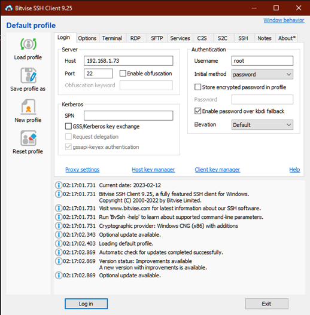
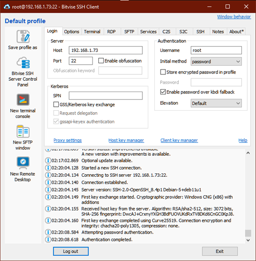

# Getting Started
## A guide for the use of a Cloud RP-Helpdesk VPS

??? success "Where to get a Cloud RP-Helpdesk VPS?" 
    ### Where to get a Cloud RP-Helpdesk VPS?
    https://cloud.rp-helpdesk.com/

??? info "Access VPS"
    ### Access VPS
    In order to access your VPS, you will have to sign up at tailscale to use their VPN software.
    https://login.tailscale.com/start

    When you have made an account, you will have to generate an auth key and send it to us, so we can 
    assign your VPS to your tailscale account. The auth key can be generate here

    https://login.tailscale.com/admin/settings/keys

??? success "Access SFTP"
    ### Access SFTP
    Bitvise SSH Client sftp Access

    

    1. Input Tailscale ip into the host field 
    2. Keep the port on 22
    3. Input the username into the username field
    4. Log in

    

    5. When successfully logged in 
    6. Click the ”New SFTP window"