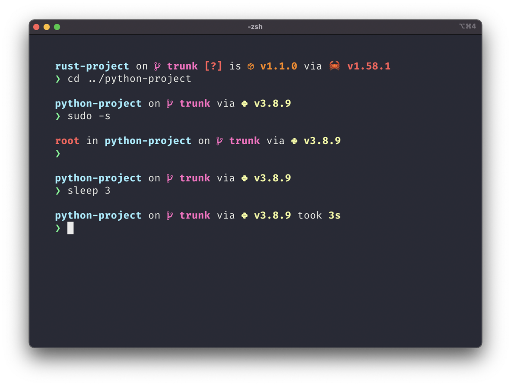

# Starship



??? info "Install Starship"
    ## Setting up Tailscale on Linux
    Tailscale works on a variety of Linux distributions. In general, you can install Tailscale on a Linux machine with a single command:

    ```
    curl -sS https://starship.rs/install.sh | sh
    ```

??? info "Setup Shell"
    Add the following to the end of `~/.bashrc`:
    ```
    eval "$(starship init bash)"
    ```